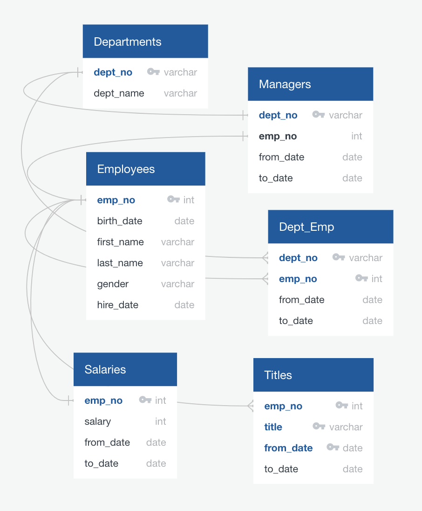
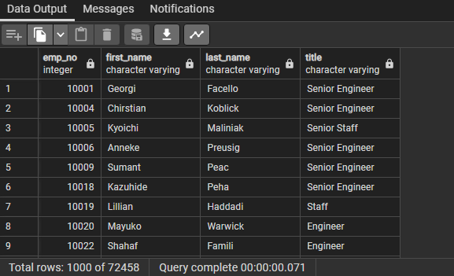
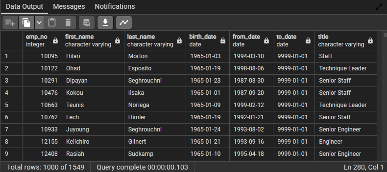
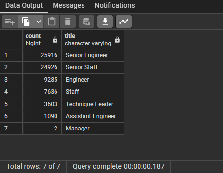

# Pewlett-Hackard-Analysis

## Overview of Analysis

The purpose of this analysis was to identify the number of individuals retiring in the next year, and determine which employees would be excellent candidates for the mentorship program. The expectation of this analysis is to implement a plan before the "silver tsunami" hits our company as employees reach retirement age.

## Results
This analysis would need to be broken into separate parts in order to fulfill the goal. 

### Find the number of retiring employees by Title

First, we needed to drill down the data in the tables to determine the number of current employees that have reached retirement age. Using the ERD diagram below, we can find the Primary keys and Foreign keys needed to link our tables together. 

For the first phase, I would need to use the:
* Employees table
* Titles table

From these tables, I would need to pull the following: 
* employee number
* first name
* last name
* title
* from working date
* to working date

To connect this all together, I created the following code: 
```
SELECT em.emp_no,
    em.first_name,
    em.last_name,
    t.title,
    t.from_date,
    t.to_date
INTO retirement_titles
FROM employees as em
    INNER JOIN titles as t
    ON (em.emp_no = t.emp_no)
WHERE (birth_date BETWEEN '1952-01-01' AND '1955-12-31');
```

Using the following code, I could find all of the employees that are currently employed at Pewlett-Hackard AND have reached retirement eligibility age. Since many employees have been promotoed over the years, the list was organized by employee number and only the employee's current title was visible.
```
SELECT DISTINCT ON (emp_no) 
emp_no,
first_name,
last_name,
title
INTO unique_titles
FROM retirement_titles
WHERE (to_date = '9999-01-01')
ORDER BY emp_no, title DESC;
```
The outcome of all this code looks like this: 


### Find the Employees eligible for the Mentorship Program

The second phase of the analysis was to create a table to determine which current employees are eligible for the Mentorship Program. The criteria to be eligible was the employee must be an active employee, and they must be born in 1965. 
To gather this information, I would need to join 3 tables this time: 
* Employees table
* Department Employee table
* Titles table

From these tables, I would need the following information: 
* employee number
* first name
* last name
* birth date
* from date
* to date
* title

In order to find all the necessary information to determine eligibility, I created the following code: 
```
SELECT DISTINCT ON (em.emp_no) em.emp_no,
    em.first_name,
    em.last_name,
    em.birth_date,
    de.from_date,
    de.to_date,
    t.title
INTO mentorship_eligibility
FROM employees as em
INNER JOIN dept_emp as de
    ON em.emp_no = de.emp_no
INNER JOIN titles as t
    ON em.emp_no = t.emp_no
WHERE (de.to_date = '9999-01-01') AND (em.birth_date BETWEEN '1965-01-01' AND '1965-12-31')
ORDER BY em.emp_no;
```
The outcome of this query gave us the following results: 

## Summary

Based on the data pulled from the queries, it is determined that a total of 72,458 employees accross the entire company are reaching retirement age. This is how many roles will need to filled as the "silver tsunami" begins to make an impact. Breaking down the number by title we can see how many roles will need to be filled per title: 

The Mentorship list above shows us that we have 1,549 current employees that could help train the new generation of Pewlett-Hackard employees. This is a very large load to put on 1,500+ employees. An idea would be to promote a number of Assitant Engineers to Senior Engineers as this is the most affected title to retire. The same can be said about Senior Staff as they come in second. Finally, using the eligible Mentors, we could create a series of classes that could be done in waves either Monthly or Quarterly (based on difficulty) to help fill those roles as the "silver tsunami" begins to impact our company. Completing this in waves would help ensure that the mentors could handle the large influx of new employees.